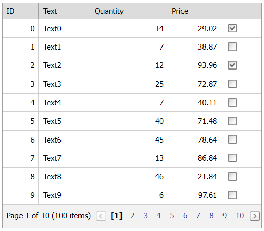

<!-- default badges list -->

[](https://supportcenter.devexpress.com/ticket/details/E3979)
[](https://docs.devexpress.com/GeneralInformation/403183)
<!-- default badges end -->
# Grid View for ASP.NET MVC - How to track changes of a checkbox editor's state
<!-- run online -->
**[[Run Online]](https://codecentral.devexpress.com/128550757/)**
<!-- run online end -->

This example demonstrates how to create a templated column, add a checkbox editor to the template, and save the editor's state on callbacks.



## Overview

Call a column's [SetDataItemTemplateContent](https://docs.devexpress.com/AspNetMvc/DevExpress.Web.Mvc.MVCxGridViewColumn.SetDataItemTemplateContent.overloads) method to specify a template and add a checkbox editor to the template. Specify the editor's `Name` property based on the row's key value.

```cshtml
@Html.DevExpress().GridView(settings => {
    settings.Name = "gvTypedListDataBinding";
    settings.CallbackRouteValues = new { Controller = "Home", Action = "TypedListDataBindingPartial" };
    settings.KeyFieldName = "ID";
    settings.Columns.Add(column => {
        column.SetDataItemTemplateContent(c => {
            Html.DevExpress().CheckBox(checkboxSettings => {
                checkboxSettings.Name = "cb_" + c.KeyValue.ToString();
                checkboxSettings.Properties.ClientSideEvents.CheckedChanged = "OnCheckedChanged";
                if(ViewData["items"] != null) {
                    Dictionary<string, bool> items = (Dictionary<string, bool>)ViewData["items"];
                    checkboxSettings.Checked = items.ContainsKey(checkboxSettings.Name) && (bool)items[checkboxSettings.Name];
                }              
            }).Render();
        });
    });
    settings.ClientSideEvents.BeginCallback = "OnBeginCallback";
}).Bind(Model).GetHtml()
```

Handle the editor's client-side `CheckedChanged` event and use a custom JS object to store the checked editor's key value. When the grid sends a callback to the server, the JS object is serialized and passed to the Controller as a custom parameter. Then this object is deserialized on the View side to restore the editor's state.

## Files to Review

* [HomeController.cs](./CS/CS/Controllers/HomeController.cs) (VB: [HomeController.vb](./VB/Controllers/HomeController.vb))
* [Index.cshtml](./CS/CS/Views/Home/Index.cshtml)
* [TypedListDataBindingPartial.cshtml](./CS/CS/Views/Home/TypedListDataBindingPartial.cshtml)

## Documentation

* [Passing Values to a Controller Action through Callbacks](https://docs.devexpress.com/AspNetMvc/9941/common-features/callback-based-functionality/passing-values-to-a-controller-action-through-callbacks)
